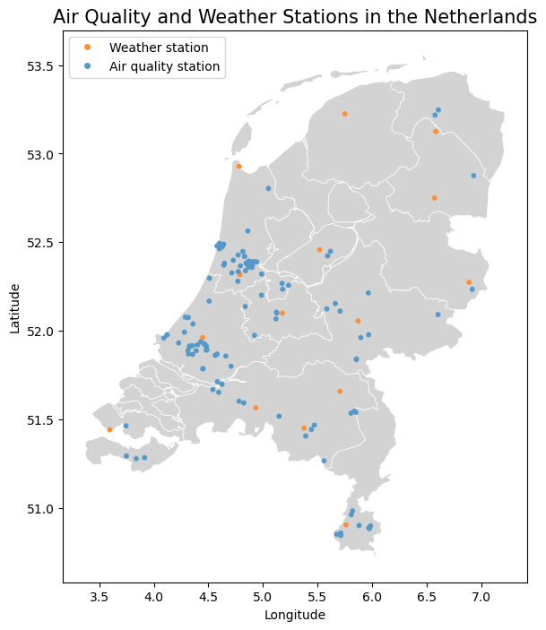
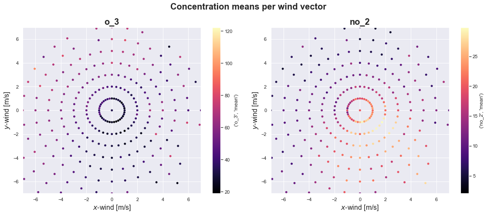
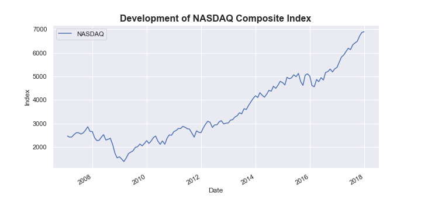

# TU/e Data Analytics

Coursework for the Data Analytics for Engineers course at Eindhoven University of
Technology (TU/e). The material works through a full data analysis pipeline in Python:
loading and cleaning data, exploring and visualizing it, modeling it, and testing
hypotheses. Each module is a Jupyter notebook of solved exercises, and the two graded
assignments apply the whole pipeline to real air quality and weather data from the
Netherlands.

The stack is the standard scientific Python set: pandas, NumPy, Matplotlib, seaborn,
scikit-learn, SciPy, and SQLite through pandas.

## Graded assignments

Both graded assignments study the relationship between air pollutant concentrations
(ozone, nitrogen dioxide) and weather factors, using measurements from air quality
stations and the nearest KNMI weather stations across the Netherlands.

The first assignment matches each air quality station to its closest weather station,
combines the two data sources, explores the compounds against a chosen weather factor
with summary statistics and z-scores, aggregates the data per year, and builds a
prediction model on a train/test split.



A bonus task visualizes how pollutant concentration relates to the wind vector, binning
mean concentration by the x and y wind components. Ozone drops and nitrogen dioxide
rises under low wind speeds near the center, which fits the expectation that still air
traps traffic emissions.



The second assignment focuses on data cleaning and inference: identifying and
interpolating missing values, cleaning weather data, approximating derivatives of
weather factors to capture their rate of change, and running a hypothesis test after
checking normality with Q-Q plots and the Anderson-Darling test.

## Module notebooks

Each folder holds one exercise notebook with the datasets it uses under `datasets/` and
the course reference material under `support/`.

| Folder | Topic | Covers |
| --- | --- | --- |
| `0_PRE` | Python preliminaries | Expressions, variables, lists, dictionaries, functions, control flow |
| `1_EDA` | Exploratory data analysis | pandas DataFrames, indexing, summary statistics, boolean masks, grouping, plotting |
| `2_VIS` | Visualization | Matplotlib plots, subplots, scatter matrices, seaborn distributions and heat maps |
| `3_DMM` | Data mining and modeling | Linear regression, decision tree classification, k-means clustering, model assessment |
| `4_ORG` | Data organization | SQL queries over SQLite, joins, subqueries, data cleaning and deduplication |
| `5_DAS` | Data analysis and statistics | Gaussian and rolling filters, numerical derivatives, aggregation, ECDFs |
| `6_HYP` | Hypothesis testing | One- and two-sample t-tests, z-tests on proportions, normality tests, regression diagnostics |

The exercises use varied datasets, including the iris measurements, Auto MPG, wheat
seeds, NASDAQ and stock prices, a mouse-versus-trackpad pointing experiment, and the
classic speed of light measurements.



## Repository layout

```
0_PRE ... 6_HYP        module folders, each with a solved exercise notebook
  datasets/            CSV inputs for that module
  support/             course summary notebooks
GA1/                   graded assignment 1 notebook and generated figures
GA2/                   graded assignment 2 notebook
*.pdf                  exported PDF versions of the two graded assignments
```

## Running the notebooks

The notebooks run under Jupyter with the scientific Python stack installed:

```
pip install pandas numpy matplotlib seaborn scikit-learn scipy jupyter
jupyter notebook
```

Open any `Exercises-*.ipynb` and run the cells in order. Datasets are stored next to
each notebook, so no extra download is needed.

## Technologies

Python, Jupyter, pandas, NumPy, Matplotlib, seaborn, scikit-learn, SciPy, SQLite.
